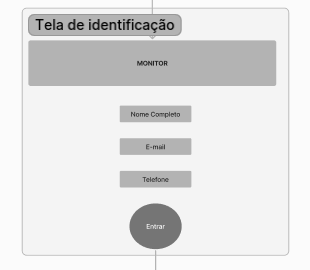
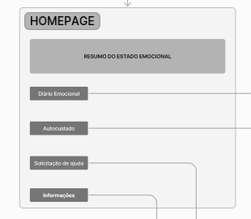
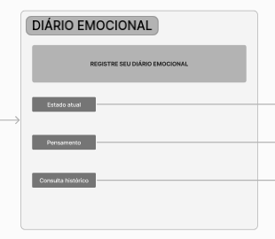
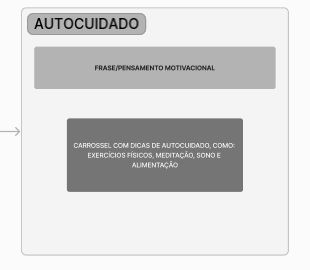
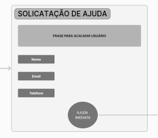
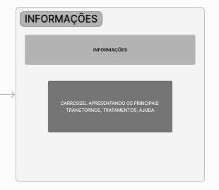

# Projeto de Interface

A seguir, apresentaremos o user flow para uma plataforma de monitoramento da saúde mental de estudantes universitários, conforme descrito nas especificações fornecidas. Esta plataforma foi projetada com base nos requisitos funcionais, não funcionais e nas histórias de usuário detalhadas na documentação de especificação. O objetivo principal é oferecer uma experiência intuitiva e eficaz para os usuários, fornecendo ferramentas e recursos para promover o bem-estar emocional e prevenir crises mentais. 

## User Flow

## Wireframes

No processo de design de interfaces para sites web, os wireframes desempenham um papel crucial ao sugerir a estrutura e os relacionamentos entre as diferentes páginas. Esses protótipos visuais oferecem uma representação simplificada do layout e dos elementos fundamentais da interface, permitindo uma visualização clara da organização do conteúdo e da navegação do usuário. Cada wireframe é cuidadosamente relacionado aos requisitos específicos que visa atender, garantindo que o design final atenda às necessidades e expectativas dos usuários. Vamos explorar um exemplo de wireframe e os requisitos que ele aborda.

### Tela de Identificação

O usuário insere seu nome completo, e-mail e define uma senha. Essa tela atende à necessidade de identificação do usuário, permitindo o acesso à plataforma.
Requisitos funcionais: RF-001, RNF-001, RNF-002, RNF-003, RNF-004.

### HomePage

Após a identificação, o usuário é direcionado para o dashboard. O dashboard fornece um resumo do estado emocional atual do usuário e acesso rápido às principais funcionalidades da plataforma, como registro de estado emocional/diário emocional, recursos de autocuidado e solicitação de ajuda. 
Requisitos funcionais: RF-002, RNF-001, RNF-002, RNF-003, RNF-004

### Diário Emocional

Aqui, o usuário pode registrar seu estado emocional atual selecionando sentimentos específicos e também pode manter um diário emocional, registrando pensamentos, sentimentos e experiências diárias. Essa tela combina as funcionalidades de registro de estado emocional e diário emocional em uma única interface, simplificando a experiência do usuário.
Requisitos funcionais: RF-003, RNF-001, RNF-002, RNF-003, RNF-004

### Autocuidado

Oferece uma lista de recursos e atividades sugeridas para ajudar no autocuidado e na promoção do bem-estar mental do usuário, como exercícios de respiração, meditação guiada e dicas de sono.
Requisitos funcionais: RF-004, RNF-001, RNF-002, RNF-003, RNF-004

### Solicitação de Ajuda

Permite que o usuário solicite ajuda ou encaminhamento para profissionais de saúde mental qualificados. O formulário inclui campos para descrever a situação e indicar preferências de contato, garantindo que o usuário receba o suporte necessário quando necessário.
Requisitos funcionais: RF-005, RNF-001, RNF-002, RNF-003, RNF-004

### Informações

A plataforma deve permitir que os usuários tenham acesso a informações sobre os principais transtornos mentais e quais são seus tratamentos. Devo fornecer características, sintomas e como identificar uma suspeita de algum distúrbio.
Requisitos funcionais: RF-006, RNF-001, RNF-002, RNF-003, RNF-004

